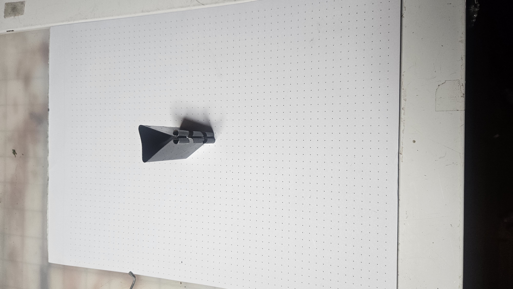

# A1 – [Topic]

## Objective

## Analyze
  Task A: Portfolio analysis
  
    1/2 (Evan Hoerl of Purdue University)
    https://ejhoerl.github.io/
  
      The portfolio is well organized with multiple pieces of work documented with thumbnail pictures and detailed explanations.
      The documentation contained inside the projects is more overview than project detail. A colleague would need to ask questions to reproduce any of the work
      The documentation does not go into specifics of how decisions were made. It simply denotes the processes used to achieve the desired results.
      The portfolio is written in a professional tone

    2/2 (Tyler Wisniewski of Cornell University)
    https://tylerwisniewski.github.io/

      The portfolio is well organized with multiple pieces of work documented with thumbnail pictures only, no subtext or captions provided
      The documentation contained inside the projects is extensive. A colleague would not need to ask questions to reproduce any of the work.  
      Full reports with CAD files, schematics and animations are provided
      The decision making process is well laid out in the associated report pdfs that are linked in the individual project descriptions.
      The portfolio is written in a professional tone.

  Task B: Product Analysis (Paper Binding Clip)

    a. Primary Function
      The primary function of the paper binding clip is to maintain document organization by securing paper pages together
      so that the pages stay together. The article is comprised of three components:
        (1) Central spring steel body.
        (2) Side arms made of metal wire.
      The primary task of the article is achieved through a clamping force generated by the elastic deformation of the spring steel central body. The user deforms the clamp open via mechanical leverage of pressing the two side arms together to open the central body 
    
    b. Governing Model
      The primary force governing the paper binding clip is described best by Hooke's law (F = kx) where:
        F = the clamping force transmitted to the paper by the spring clamp
        k = the spring coefficient of the spring steel
        x = the deformation displacement of the spring (in this case, the opening width of the clamp)
      This model assumes negligible effects of gravity on the pages being held and negligible friction in the clamp.

    c. Photographs:
      

    

## Decide

## Communicate

